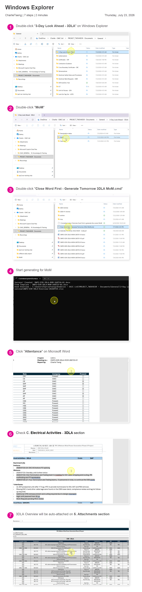

# 3DLA MoM｜5 steps

<div class="oaic-path-chip">📊 Finish Overview → 📝 Generate MoM</div>

<div class="oaic-visual-steps" markdown>

<section class="oaic-visual-step">
  <div class="oaic-visual-step__number">1</div>
  <div class="oaic-visual-step__icon" aria-hidden="true">💾</div>
  <div>
    <h2>Finish and save tomorrow's Overview</h2>
  </div>
</section>

<section class="oaic-visual-step">
  <div class="oaic-visual-step__number">2</div>
  <div class="oaic-visual-step__icon" aria-hidden="true">❌</div>
  <div>
    <h2>Close every Word window</h2>
  </div>
</section>

<section class="oaic-visual-step">
  <div class="oaic-visual-step__number">3</div>
  <div class="oaic-visual-step__icon" aria-hidden="true">🖱️</div>
  <div>
    <h2>Double-click the .cmd file in MoM</h2>
    <code>Close Word First - Generate Tomorrow 3DLA MoM.cmd</code>
  </div>
</section>

<section class="oaic-visual-step">
  <div class="oaic-visual-step__number">4</div>
  <div class="oaic-visual-step__icon" aria-hidden="true">📄</div>
  <div>
    <h2>Open the new Word file</h2>
  </div>
</section>

<section class="oaic-visual-step oaic-visual-step--check">
  <div class="oaic-visual-step__number">5</div>
  <div class="oaic-visual-step__icon" aria-hidden="true">🔎</div>
  <div>
    <h2>Check 4 places</h2>
    <p><strong>Date · Meeting no. · Attachment A · Attachment B</strong></p>
  </div>
</section>

</div>

{ .oaic-step-shot .oaic-step-shot--tall loading=lazy }

!!! warning "A MoM for the same date already exists"
    The tool stops without overwriting. Use `-Overwrite` only when you are sure.

<details class="oaic-compact-details" markdown>
<summary>Folder locations</summary>

- MoM: `OAIC Ltd\PROJECT_TWSHXESR - Documents\General\3-Day Look Ahead - 3DLA\MoM`
- Overview: `OAIC Ltd\PROJECT_TWSHXESR - Documents\General\3-Day Look Ahead - 3DLA\Overview`

</details>

<details class="oaic-compact-details" markdown>
<summary>Regenerate the same date</summary>

```powershell
powershell -Sta -NoProfile -ExecutionPolicy Bypass -File "Generate Tomorrow 3DLA MoM - Code.ps1" -TargetDate "2026-07-06" -Overwrite -Open
```

</details>
