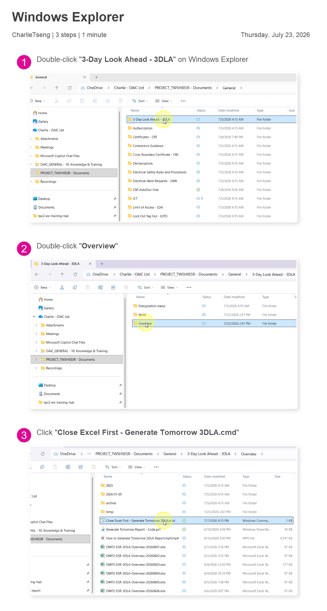
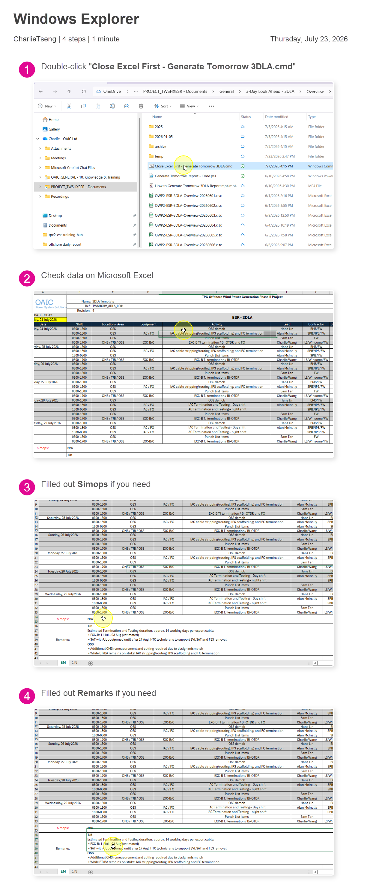

# 3DLA Overview｜4 步完成

<section class="oaic-visual-step">
  
1

  
❌

  

    <h2>關閉最新的 Overview Excel</h2>
  

</section>

<section class="oaic-visual-step">
  
2

  
🖱️

  

    <h2>雙擊 .cmd</h2>
    <code>Close Excel First - Generate Tomorrow 3DLA.cmd</code>
  

</section>

{ .oaic-step-shot .oaic-step-shot--tall loading=lazy }

<section class="oaic-visual-step">
  
3

  
⏳

  

    <h2>等待程式完成</h2>
    
新檔案會自動出現在同一個資料夾。

  

</section>

<section class="oaic-visual-step oaic-visual-step--check">
  
4

  
🔎

  

    <h2>打開新檔 → 檢查 → 發出</h2>
    
<strong>Date · Activities · Simops · Remarks</strong>

  

</section>

{ .oaic-step-shot .oaic-step-shot--tall loading=lazy }

!!! tip "出現錯誤？"
    關閉所有 Excel 視窗，再雙擊 `.cmd`。

程式自動完成的內容

- 產生明日檔案並更新日期
- 將 look-ahead activities 往前帶
- 自動調整列數與底色
- 保留 Simops / Remarks

