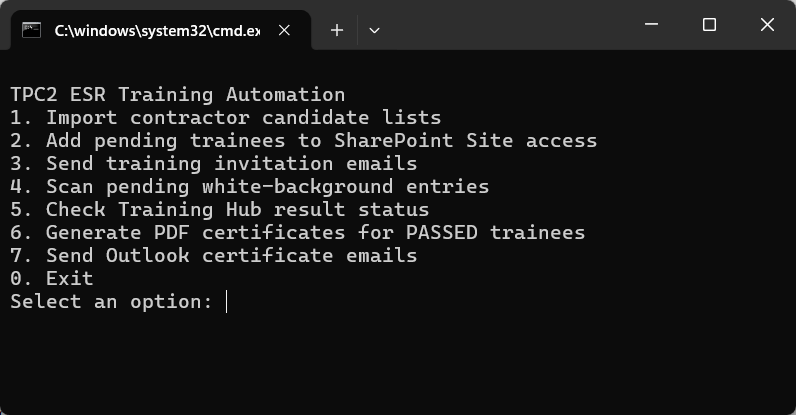

# ESR P/CP Training Automation - Quick Guide

The ESR P/CP Training workflow is now around **95% automated** and ready for day-to-day use. A few small bugs may still appear as Outlook or SharePoint changes; these will be fixed as they are found.

Main folder:

```text
OAIC Ltd\PROJECT_TWSHXESR - Documents\General\ESR AutoDoc Hub\04_ESR Training
```

Double-click:

```text
Run ESR Training Automation (English).cmd
```

or use the Chinese launcher:

```text
Run ESR Training Automation (中文).cmd
```

## What You Will See

After opening the launcher, you should see this CLI menu. Type the command number and press **Enter**.



Most of the work is done from this menu. Use the Outlook templates only when the workflow below says so.

## One-Time Python Setup

Run this once on each computer before using the ESR AutoDoc tools.

1. Open this folder:

```text
OAIC Ltd\PROJECT_TWSHXESR - Documents\General\ESR AutoDoc Hub\04_ESR Training
```

2. Double-click:

```text
Install ESR Automation Prerequisites.cmd
```

3. Wait until the black window shows:

```text
Python packages OK
Done. ESR AutoDoc tools are ready on this computer.
```

This installer downloads a stable Python 3.13 release from `python.org`, installs it for the current Windows user, adds Python to PATH, and installs the required packages in one go:

```text
openpyxl pypdf reportlab pillow playwright
```

If HP Sure Click or Windows security asks, allow the installer to run after confirming it is from `python.org`.

Current software requirements:

| Automation | Required software |
|---|---|
| ESR Training | Python 3 and the packages listed above |
| 3DLA MoM | Windows PowerShell, Microsoft Word and Excel |
| 3DLA Overview | Windows PowerShell and Microsoft Excel |
| DPR | Windows PowerShell, Microsoft Word and Excel |

If the installer fails, ask Charlie or IT to help run the same file again from the ESR Training folder.

## Before You Start

1. Use `Person _ CP Candidate Request.oft` when asking a contractor to provide the list of people who need Person or Competent Person training.
2. When the contractor returns the completed register, save it here:

```text
04_ESR Training\01_Inbox\P_CP Candidate Lists
```

The file name should normally follow this pattern:

```text
TPC2_ESR_P_CP_Training_Register_[Company Name].xlsx
```

3. Close related Excel files and Outlook draft windows before running the tool.

## Key Locations

Email templates:

```text
04_ESR Training\00_Template\Training email Templates
```

Training result Excel files:

```text
04_ESR Training\02_Processing
```

Generated certificates:

```text
04_ESR Training\04_Certificates
```

The official register is not moved into the AutoDoc Hub. It stays here:

```text
OAIC Ltd\PROJECT_TWSHXESR - Documents\General\Safety Document - SFD Register\TWSHXHV_ESR_OverallRegister.xlsm
```

The script writes candidate data into the `Old Training Register` sheet in that workbook.

## Workflow Map

The picture below is the quickest way to understand the sequence.


Use this table to see when to use an Outlook template and when to run a command in the CLI.

| Stage | Email template | CLI command |
|---|---|---|
| Ask contractor for P/CP candidates | `1. Person _ CP Candidate Request.oft` | None |
| Import returned candidate list | None | `1. Import contractor candidate lists` |
| Confirm existing valid / possible matches | `2. ESR Training - Candidate Validity Confirmation.oft` | Use only if the Step 1 summary needs contractor confirmation |
| Add Training Hub Site access | None | `2. Add pending trainees to SharePoint Site access` |
| Send training invitations | `3.1 Person Training invitation.oft` / `3.2 CP Training invitation.oft` | `3. Send training invitation emails` |
| Wait for trainees to complete training | None | No command; allow time for results to appear |
| Check pending trainees | None | `4. Scan pending white-background entries` |
| Check results | Optional: `4. Person _ CP Re-training Required.oft` if a retake notice is needed | `5. Check Training Hub result status` |
| Generate certificates | None | `6. Generate PDF certificates for PASSED trainees` |
| Send certificates | `5.1 Person Training - Certificate.oft` / `5.2 CP Training - Certificate.oft` | `7. Send Outlook certificate emails` |

## Step-by-Step Workflow

### 1. Ask the contractor for the P/CP candidate list

**Use email template:** `1. Person _ CP Candidate Request.oft`

1.1 Send this template to the contractor and ask them to complete the P/CP candidate list.

1.2 When the contractor returns the completed file, save it in:

```text
04_ESR Training\01_Inbox\P_CP Candidate Lists
```

### 2. Import the returned candidate list

**Run CLI command:** `1. Import contractor candidate lists`

This is the command window option to use:


2.1 The command reads contractor files from `01_Inbox\P_CP Candidate Lists`.

2.2 Before importing anyone, it checks the official `Old Training Register`:

- ESR Training records are valid for `730 days` from the training result date.
- Email is matched first.
- If email is not available, full name is checked.
- Name-only matches are shown as possible matches and are not silently skipped.
- If a valid record is found, the person is not imported as a pending white-background trainee.
- If fewer than `30 days` remain, the record is marked `EXPIRING SOON`.

2.3 The command summary shows:

- existing valid records found,
- new or expired personnel imported,
- possible matches requiring manual confirmation.

2.4 If someone already has valid ESR Training, the black command window will show a section like:

```text
COPY TO TEMPLATE 2 - Candidate Validity Confirmation
```

Copy the names shown under that heading. These are the people who have already passed and do not need to complete training again at this stage.


2.5 Open the email templates folder and use the second template:

```text
2. ESR Training - Candidate Validity Confirmation.oft
```


2.6 Paste the copied names into the highlighted part of the email body, then send it to the contractor contact person.


2.7 Step 1 does not send emails. It only imports required trainees and prepares a clear summary.

### 3. Add trainees to SharePoint Site access

**Run CLI command:** `2. Add pending trainees to SharePoint Site access`

3.1 The command opens the Training Hub and adds pending white-background trainees to Site access.

3.2 Do not use the mouse or keyboard while this is running. Grab a tea, take a quick break, and let it finish.

### 4. Send training invitation emails

**Run CLI command:** `3. Send training invitation emails`

4.1 The command uses these templates automatically:

- `3.1 Person Training invitation.oft`
- `3.2 CP Training invitation.oft`

4.2 Person and CP recipients are added to BCC and the emails are sent automatically.

4.3 Check the pending white-background list before running this command, because it really sends the emails.

### 5. Check who is still pending

**Run CLI command:** `4. Scan pending white-background entries`

5.1 This shows the trainees still waiting in the white-background pending list.

5.2 Use this after invitations have been sent, or while waiting for people to complete the training.

### 6. Check Training Hub result status

**Run CLI command:** `5. Check Training Hub result status`

6.1 The command searches the Training Hub result workbooks in `02_Processing`.

6.2 Passing score:

- Person: `>= 36`
- CP: Module 1 and Module 2 must both be `>= 20`

6.3 For Training Hub result workbooks, only results within roughly the last 6 months are treated as the current attempt. This prevents last year's result from being mistaken as the new attempt.

6.4 This is separate from the Step 1 certificate validity check. Step 1 checks whether an existing record in the official register is still valid within `730 days`.

6.5 If someone needs to be asked to retake the training, use:

```text
4. Person _ CP Re-training Required.oft
```

### 7. Generate PDF certificates

**Run CLI command:** `6. Generate PDF certificates for PASSED trainees`

7.1 The command creates non-editable image-style PDF certificates only for trainees with a valid `PASSED` result.

7.2 Certificates are saved in:

```text
04_Certificates\Person
04_Certificates\Competent Person
```

### 8. Send certificate emails

**Run CLI command:** `7. Send Outlook certificate emails`

8.1 The command uses these templates automatically:

- `5.1 Person Training - Certificate.oft`
- `5.2 CP Training - Certificate.oft`

8.2 It fills in the recipient email, attaches the generated PDF certificate, and sends the email directly to the trainee who has passed.

## What Is Automated

- No manual key-in of trainee details.
- No manual SharePoint Site access entry.
- No manual training invitation email preparation.
- No manual pass/fail checking; the result and passed date are shown on screen.
- No manual ESR certificate preparation.
- No manual certificate attachment and email preparation.

## Notes

- Close related Excel files and Outlook drafts before running the tool.
- Please leave the mouse and keyboard alone while SharePoint or Outlook automation is running.
- If someone passed before but the result is older than 6 months, the tool will not use that old result as the current pass.
- If Outlook or SharePoint gets stuck, close the related windows and run that step again.
- The tool is now close to fully automated, but small bugs may still appear when Microsoft updates Outlook or SharePoint.
