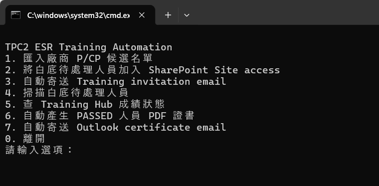
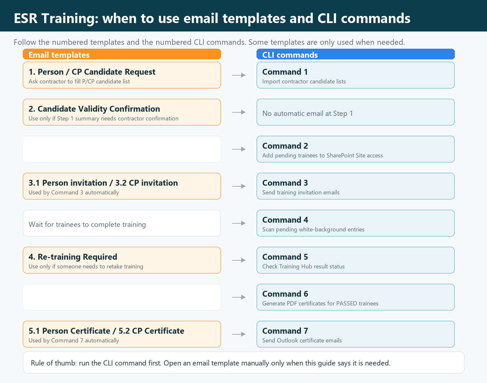
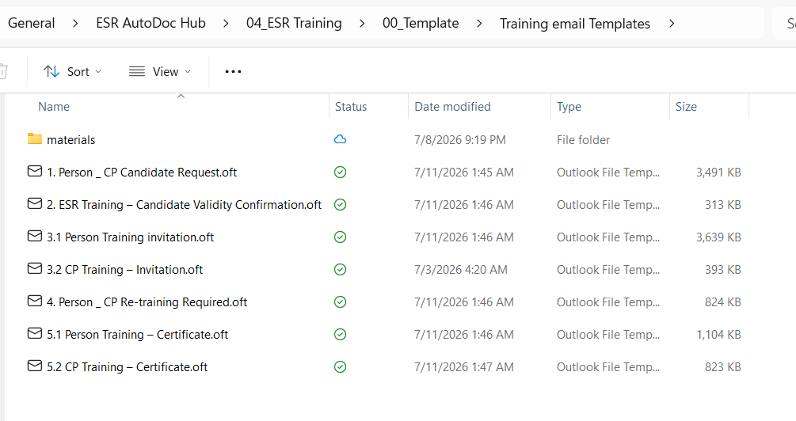
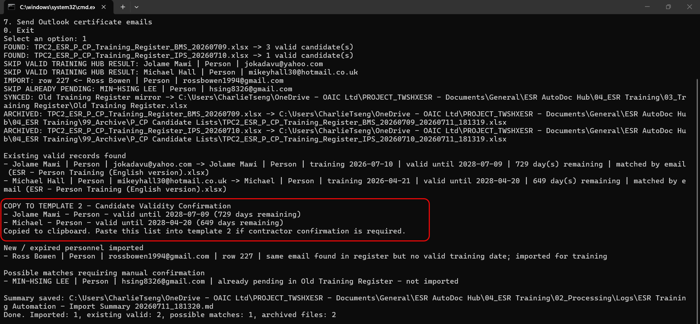
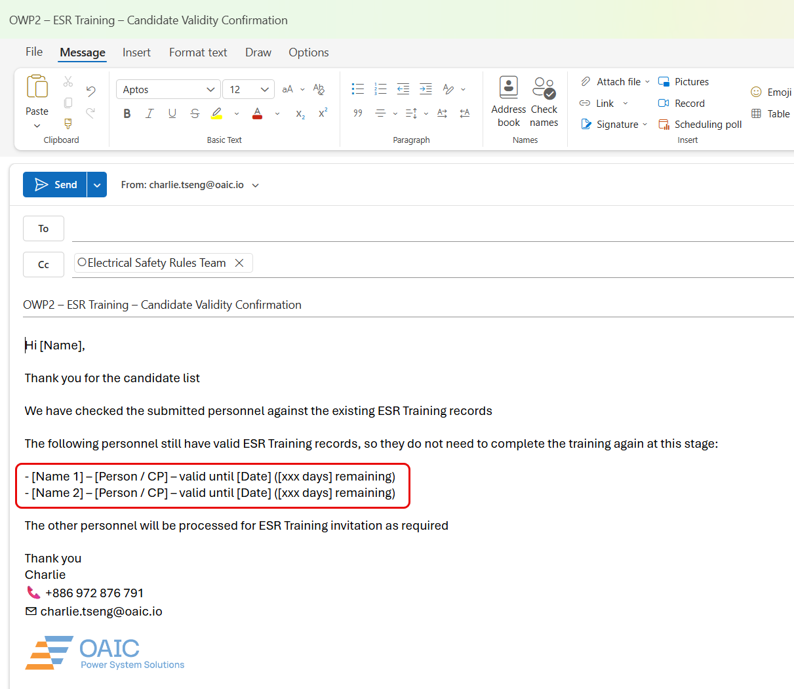
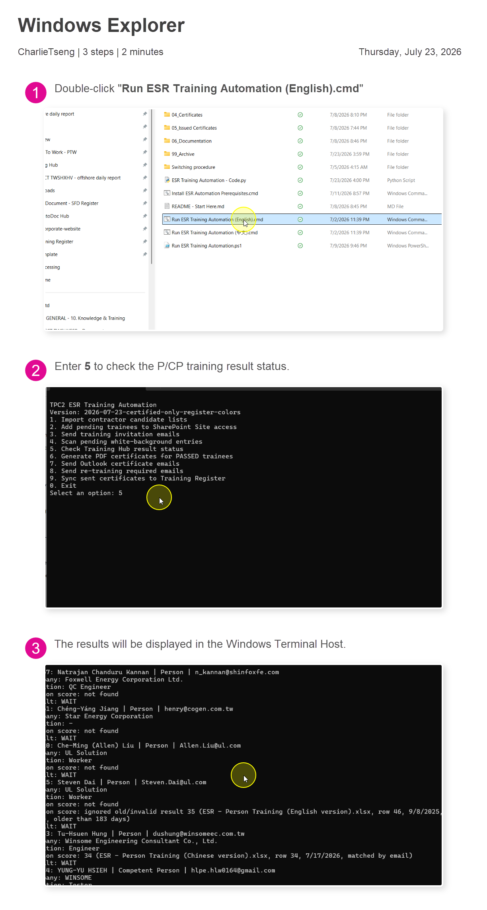
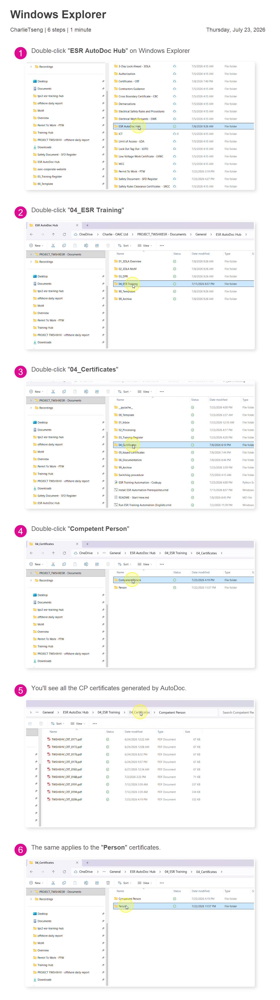
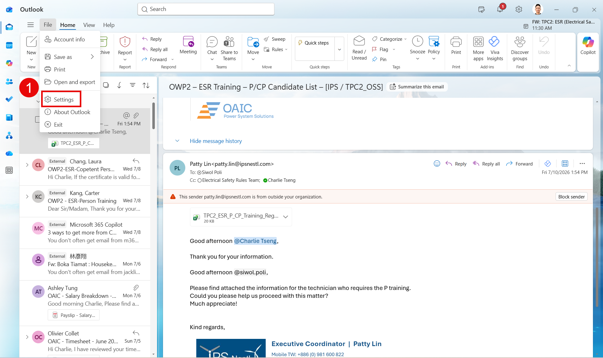
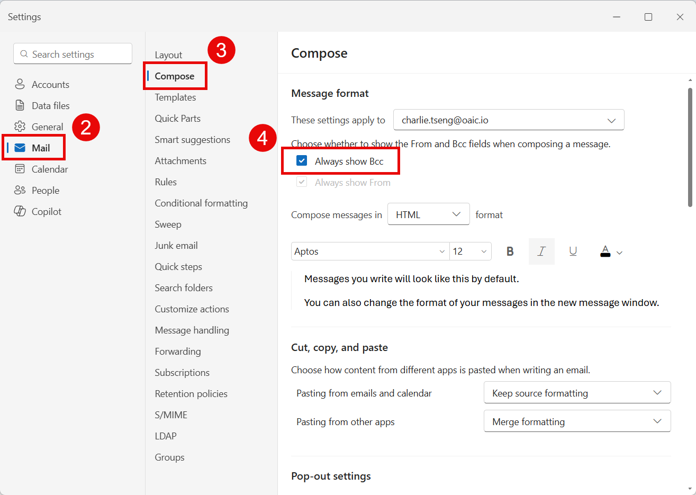

# ESR P/CP Training｜照順序操作

約 95% 自動化 · 發現小 bug 會持續修正

  ▶️
  

    <strong>每次都從這裡開始</strong>
    <code>Run ESR Training Automation (中文).cmd</code>
  

{ .oaic-step-shot }

!!! danger "會真的寄出 Email"
    Command `3` 與 `7` 會直接寄信。執行前先確認人員與 Email。

{ .oaic-step-shot }

## 日常流程

<section class="oaic-visual-step oaic-visual-step--with-shot">
  
1

  
📨

  

    <h2>取得候選名單</h2>
    
寄出 <code>1. Person _ CP Candidate Request.oft</code>

    
收到 Excel → 放入 <code>01_Inbox\P_CP Candidate Lists</code>

  

</section>

{ .oaic-step-shot }

<section class="oaic-visual-step oaic-visual-step--with-shot">
  
2

  
📥

  

    <h2>CLI → Command 1</h2>
    
<strong>匯入廠商 P/CP 候選名單</strong>

    
若看到 <code>COPY TO TEMPLATE 2</code>：複製名單 → 貼入 Template 2 → 寄給廠商。

  

</section>

{ .oaic-step-shot }

{ .oaic-step-shot }

<section class="oaic-visual-step">
  
3

  
🌐

  

    <h2>CLI → Command 2</h2>
    
<strong>加入 SharePoint Site access</strong>

    
執行時不要使用滑鼠或鍵盤。

  

</section>

<section class="oaic-visual-step oaic-visual-step--danger">
  
4

  
✉️

  

    <h2>CLI → Command 3</h2>
    
<strong>寄送 Training invitation</strong>

    
檢查白底人員 → 執行 → Email 直接寄出。

  

</section>

<section class="oaic-visual-step">
  
5

  
🔎

  

    <h2>CLI → Command 4，再 Command 5</h2>
    
<strong>掃描待處理人員 → 查 Training Hub 成績</strong>

    
Person ≥ 36；CP Module 1、2 各 ≥ 20。

  

</section>

{ .oaic-step-shot .oaic-step-shot--tall loading=lazy }

<section class="oaic-visual-step">
  
6

  
📜

  

    <h2>CLI → Command 6</h2>
    
<strong>產生 PASSED 人員 PDF 證書</strong>

    
檢查 <code>04_Certificates</code>

  

</section>

{ .oaic-step-shot .oaic-step-shot--tall loading=lazy }

<section class="oaic-visual-step oaic-visual-step--danger">
  
7

  
📤

  

    <h2>CLI → Command 7</h2>
    
<strong>寄送 Certificate email</strong>

    
檢查 Email 與 PDF → 執行 → Email 直接寄出。

  

</section>

第一次使用：Python + Outlook Bcc

1. 雙擊 `Install ESR Automation Prerequisites.cmd`
2. 等待顯示 `Python packages OK`
3. Outlook：**File → Settings**

{ .oaic-step-shot }

4. **Mail → Compose → Always show Bcc**

{ .oaic-step-shot }

重要規則與資料位置

- 正式 Register：`Safety Document - SFD Register\TWSHXHV_ESR_OverallRegister.xlsm`
- 寫入工作頁：`Old Training Register`
- 已有訓練紀錄有效期：730 天；少於 30 天會顯示 `EXPIRING SOON`
- 本次 Training Hub 成績：只採用最近約 6 個月的結果
- Email templates：`00_Template\Training email Templates`
- Training results：`02_Processing`
- Certificates：`04_Certificates`
- 需要重訓時：使用 `4. Person _ CP Re-training Required.oft`

!!! tip "卡住？"
    關閉相關 Excel / Outlook 視窗，再執行同一個 command。
