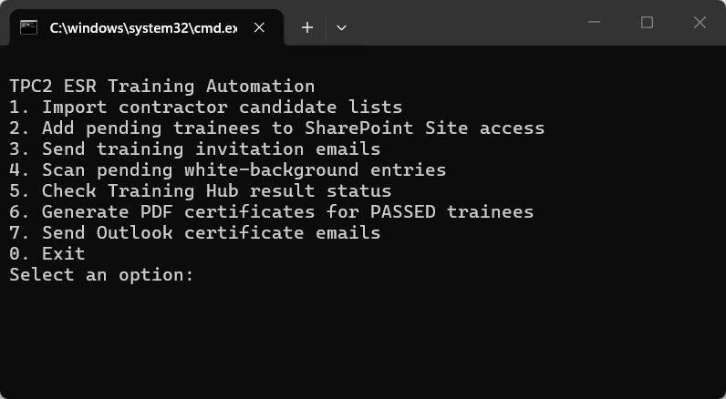

# ESR P/CP Training 自動化流程 - 快速使用說明

目前 ESR P/CP Training 流程已完成約 **95% 自動化**，日常作業已可使用。後續如果發現少量 bug，會再逐步修正。

主入口資料夾：

```text
OAIC Ltd\PROJECT_TWSHXESR - Documents\General\ESR AutoDoc Hub\04_ESR Training
```

請雙擊：

```text
Run ESR Training Automation (中文).cmd
```

或使用英文版：

```text
Run ESR Training Automation (English).cmd
```

## 打開後會看到的畫面

打開啟動檔後，應該會看到這個 CLI 選單。輸入 command 編號後，按 **Enter** 即可執行。


主要操作都從這個選單執行。Outlook templates 只有在下面流程說需要使用時，才需要另外打開。

## 首次使用：安裝 Python

每台電腦只需要執行一次。

1. 開啟這個資料夾：

```text
OAIC Ltd\PROJECT_TWSHXESR - Documents\General\ESR AutoDoc Hub\04_ESR Training
```

2. 雙擊：

```text
Install ESR Automation Prerequisites.cmd
```

3. 等黑色視窗顯示：

```text
Python packages OK
Done. ESR AutoDoc tools are ready on this computer.
```

這個安裝檔會自動從 `python.org` 下載穩定版 Python 3.13、安裝到目前 Windows 使用者、加入 PATH，並一次安裝需要的套件：

```text
openpyxl pypdf reportlab pillow playwright
```

如果 HP Sure Click 或 Windows security 跳出提示，確認來源是 `python.org` 後允許執行。

目前軟體需求：

| 自動化工具 | 需要的軟體 |
|---|---|
| ESR Training | Python 3 與上述套件 |
| 3DLA MoM | Windows PowerShell、Microsoft Word 與 Excel |
| 3DLA Overview | Windows PowerShell 與 Microsoft Excel |
| DPR | Windows PowerShell、Microsoft Word 與 Excel |

如果安裝失敗，請找 Charlie 或 IT 協助重新執行同一個安裝檔。

## 使用前準備

1. 如需請廠商提供 Person / Competent Person 名單，使用 `Person _ CP Candidate Request.oft` 範本寄信。
2. 廠商回填後，把檔案放到：

```text
04_ESR Training\01_Inbox\P_CP Candidate Lists
```

檔名建議保持：

```text
TPC2_ESR_P_CP_Training_Register_[Company Name].xlsx
```

3. 執行前請關閉相關 Excel / Outlook 視窗，避免檔案被鎖住。

## 重要資料位置

Email templates：

```text
04_ESR Training\00_Template\Training email Templates
```

Training result Excel：

```text
04_ESR Training\02_Processing
```

自動化產生的證書：

```text
04_ESR Training\04_Certificates
```

正式 Register 不搬到 AutoDoc Hub，仍保留在：

```text
OAIC Ltd\PROJECT_TWSHXESR - Documents\General\Safety Document - SFD Register\TWSHXHV_ESR_OverallRegister.xlsm
```

腳本會自動把候選人資料寫入這份 workbook 的 `Old Training Register` 工作頁。

## 流程對照表

先看下面這張圖，最快理解整個順序。


先看這張表，判斷什麼時候要用 Outlook template，什麼時候要回到 CLI 執行 command。

| 階段 | Email template | CLI command |
|---|---|---|
| 請廠商提供 P/CP 候選名單 | `1. Person _ CP Candidate Request.oft` | 無 |
| 匯入廠商回填名單 | 無 | `1. 匯入廠商 P/CP 候選名單` |
| 確認既有有效紀錄 / possible matches | `2. ESR Training - Candidate Validity Confirmation.oft` | 只有 Step 1 summary 需要廠商確認時才使用 |
| 加入 Training Hub Site access | 無 | `2. 將白底待處理人員加入 SharePoint Site access` |
| 寄送 Training invitation | `3.1 Person Training invitation.oft` / `3.2 CP Training invitation.oft` | `3. 自動寄送 Training invitation email` |
| 等學員完成 training | 無 | 不需 command，等待成績出現在 Training Hub result workbook |
| 檢查目前待處理人員 | 無 | `4. 掃描白底待處理人員` |
| 查詢 training result | 視需要使用 `4. Person _ CP Re-training Required.oft` | `5. 查 Training Hub 成績狀態` |
| 產生證書 | 無 | `6. 自動產生 PASSED 人員 PDF 證書` |
| 寄送證書 | `5.1 Person Training - Certificate.oft` / `5.2 CP Training - Certificate.oft` | `7. 自動寄送 Outlook certificate email` |

## 建議操作順序

### 1. 請廠商填寫 P/CP 候選名單

**使用 email template：** `1. Person _ CP Candidate Request.oft`

1.1 用這個範本寄給廠商，請他們填寫需要參加 Person / Competent Person training 的名單。

1.2 收到廠商回填檔後，放到：

```text
04_ESR Training\01_Inbox\P_CP Candidate Lists
```

### 2. 匯入廠商回填名單

**執行 CLI command：** `1. 匯入廠商 P/CP 候選名單`

請在黑色指令視窗選擇第 1 個 command：



2.1 此 command 會讀取 `01_Inbox\P_CP Candidate Lists` 內的廠商回填檔。

2.2 匯入前會先檢查正式 `Old Training Register`：

- ESR Training 既有紀錄從 training result date 起算，有效期為 `730 天`。
- 系統會優先用 email 比對。
- 如果沒有 email，才會用 full name 比對。
- 只有姓名相符時，會列為 possible match，不會默默跳過。
- 如果找到有效紀錄，該人員不會被匯入成白底待處理人員。
- 如果有效期剩餘少於 `30 天`，會標示為 `EXPIRING SOON`。

2.3 Command 結束時會顯示 summary：

- 已找到的有效紀錄
- 新增或已過期並匯入的人員
- 需要人工確認的 possible matches

2.4 如果有人已經有有效的 ESR Training，黑色指令視窗會顯示這段：

```text
COPY TO TEMPLATE 2 - Candidate Validity Confirmation
```

請複製這個標題下面的名單。這些人代表已經通過且仍在有效期內，目前不需要再考一次。


2.5 到 email templates 資料夾，打開第 2 個範本：

```text
2. ESR Training - Candidate Validity Confirmation.oft
```


2.6 把剛才複製的名單，貼到 email 內文紅框的位置，再寄給廠商對應窗口，告訴他們這些人仍有效，不需要重新訓練。


2.7 Step 1 不會自動寄 email。它只會匯入需要訓練的人員，並準備清楚的 summary。

### 3. 將人員加入 SharePoint Site access

**執行 CLI command：** `2. 將白底待處理人員加入 SharePoint Site access`

3.1 此 command 會開啟 Training Hub，將白底待處理人員加入 Site access。

3.2 執行期間請暫時不要操作滑鼠或鍵盤。去喝杯茶、上個廁所，讓它安靜跑完。

### 4. 寄送 Training invitation email

**執行 CLI command：** `3. 自動寄送 Training invitation email`

4.1 此 command 會自動使用：

- `3.1 Person Training invitation.oft`
- `3.2 CP Training invitation.oft`

4.2 Person / CP 收件人會自動放入 BCC，然後直接寄出。

4.3 執行前請先確認白底待處理名單正確，因為此步驟會真的寄出 email。

### 5. 檢查目前仍待處理的人員

**執行 CLI command：** `4. 掃描白底待處理人員`

5.1 這個 command 會顯示目前仍留在白底待處理名單的人員。

5.2 可在寄出 invitation 後、等待學員完成 training 的期間使用。

### 6. 查 Training Hub 成績狀態

**執行 CLI command：** `5. 查 Training Hub 成績狀態`

6.1 此 command 會搜尋 `02_Processing` 內的 Training Hub 成績檔。

6.2 通過標準：

- Person：`>= 36` 分
- CP：Module 1 與 Module 2 都需 `>= 20` 分

6.3 對 Training Hub result workbook 來說，系統只會採用最近約 6 個月內的結果作為這次 training attempt，避免把去年同名紀錄誤判為這次通過。

6.4 這和 Step 1 的既有證書有效期判斷不同。Step 1 是檢查正式 Register 內既有紀錄是否仍在 `730 天` 有效期內。

6.5 如果需要通知對方重新 training，使用：

```text
4. Person _ CP Re-training Required.oft
```

### 7. 產生 PDF 證書

**執行 CLI command：** `6. 自動產生 PASSED 人員 PDF 證書`

7.1 此 command 只會對有效 `PASSED` 的人員產生不可編輯的圖片式 PDF 證書。

7.2 證書會存放在：

```text
04_Certificates\Person
04_Certificates\Competent Person
```

### 8. 寄送 certificate email

**執行 CLI command：** `7. 自動寄送 Outlook certificate email`

8.1 此 command 會自動使用：

- `5.1 Person Training - Certificate.oft`
- `5.2 CP Training - Certificate.oft`

8.2 系統會自動填入收件人 email、附上剛產生的 PDF 證書，並直接寄給已通過測驗的人員。

## 已自動化的部分

- 不需要手動 key-in 人員資料。
- 不需要手動加入 SharePoint Site access。
- 不需要手動寄 Training invitation email。
- 不需要手動檢查是否通過，結果與通過日期會顯示在畫面上。
- 不需要手動製作 ESR 證書。
- 不需要手動附上證書寄出 certificate email。

## 小提醒

- 執行前請先關閉相關 Excel / Outlook 草稿視窗。
- 自動操作 SharePoint 或 Outlook 時，請暫時不要使用滑鼠與鍵盤。
- 如果人員以前曾經通過，但超過 6 個月，系統不會把舊成績當作這次通過。
- 如果 Outlook 或 SharePoint 畫面卡住，先關閉相關視窗，再重新執行該步驟。
- 此工具已接近完整自動化，但仍可能因 Outlook / SharePoint 介面更新而出現小 bug，發現後再修。
