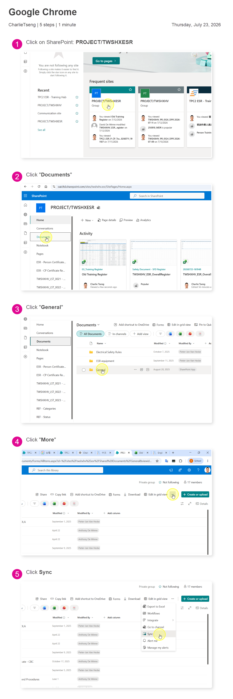
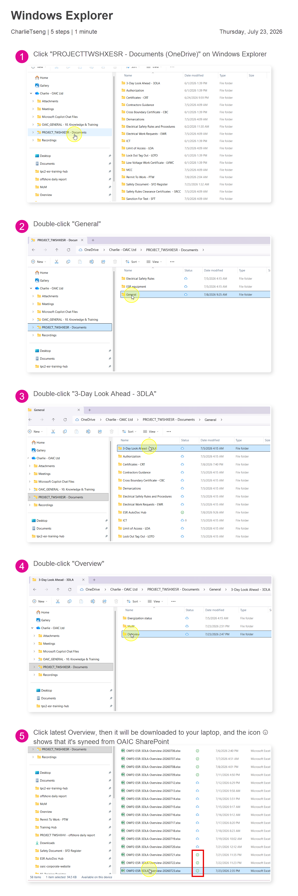

# Step 0｜First-time setup

Do this once. Repeat only after OneDrive is reinstalled or its path changes.

<section class="oaic-visual-step">
  
1

  
🌐

  

    <h2>Open OAIC SharePoint</h2>
    <a class="oaic-inline-button" href="https://oaicltd.sharepoint.com/_layouts/15/sharepoint.aspx">Open SharePoint</a>
  

</section>

<section class="oaic-visual-step">
  
2

  
☁️

  

    <h2>Find the folder → Sync</h2>
    
Choose the workflow you need.

  

</section>

{ .oaic-step-shot .oaic-step-shot--tall loading=lazy }

<section class="oaic-visual-step">
  
3

  
✅

  

    <h2>Wait for OneDrive</h2>
    
When File Explorer shows a green tick, open the latest automation file once.

  

</section>

{ .oaic-step-shot .oaic-step-shot--tall loading=lazy }

<section class="oaic-visual-step">
  
4

  
🐍

  

    <h2>ESR Training only</h2>
    <code>Install ESR Automation Prerequisites.cmd</code>
    
<strong>Python packages OK</strong> means it is ready.

  

</section>

<section class="oaic-visual-step">
  
5

  
▶️

  

    <h2>Close Word / Excel → Start</h2>
    
Return to Home and choose a workflow.

  

</section>

Which folders should I sync?

| Workflow | SharePoint folder |
|---|---|
| 3DLA MoM | `PROJECT TWSHXESR / Documents / General / 3-Day Look Ahead - 3DLA / MoM` |
| 3DLA Overview | `PROJECT TWSHXESR / Documents / General / 3-Day Look Ahead - 3DLA / Overview` |
| ESR Training | `PROJECT TWSHXESR / Documents / General / ESR AutoDoc Hub / 04_ESR Training` |
| ESR Register | `PROJECT TWSHXESR / Documents / General / Safety Document - SFD Register` |
| DPR | `PROJECT TWSHXHV / offshore daily report` |

!!! warning "File not found?"
    Check for the green tick → close Office → run again.
