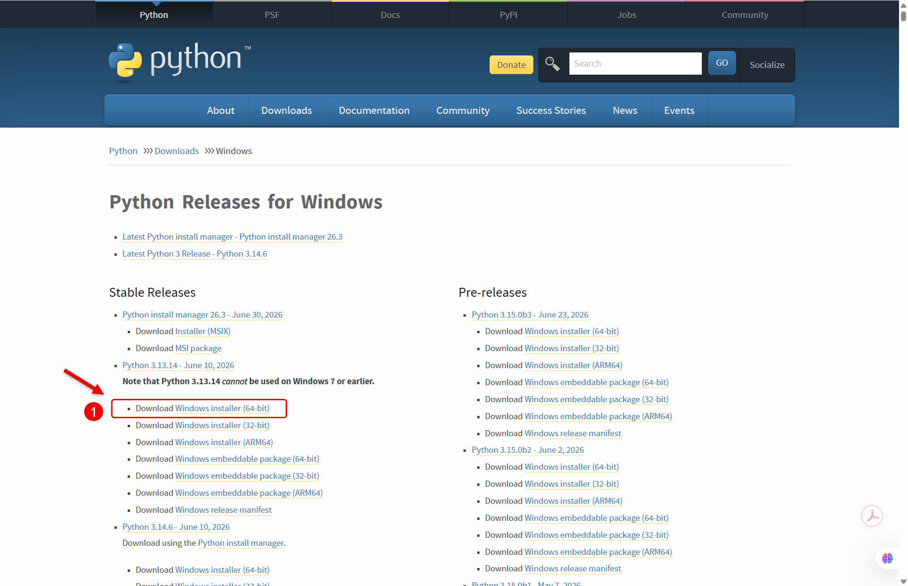
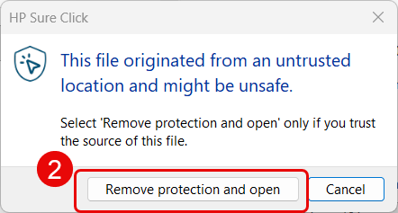
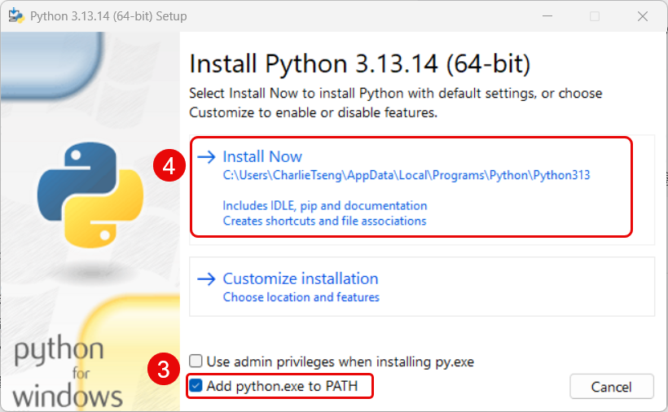
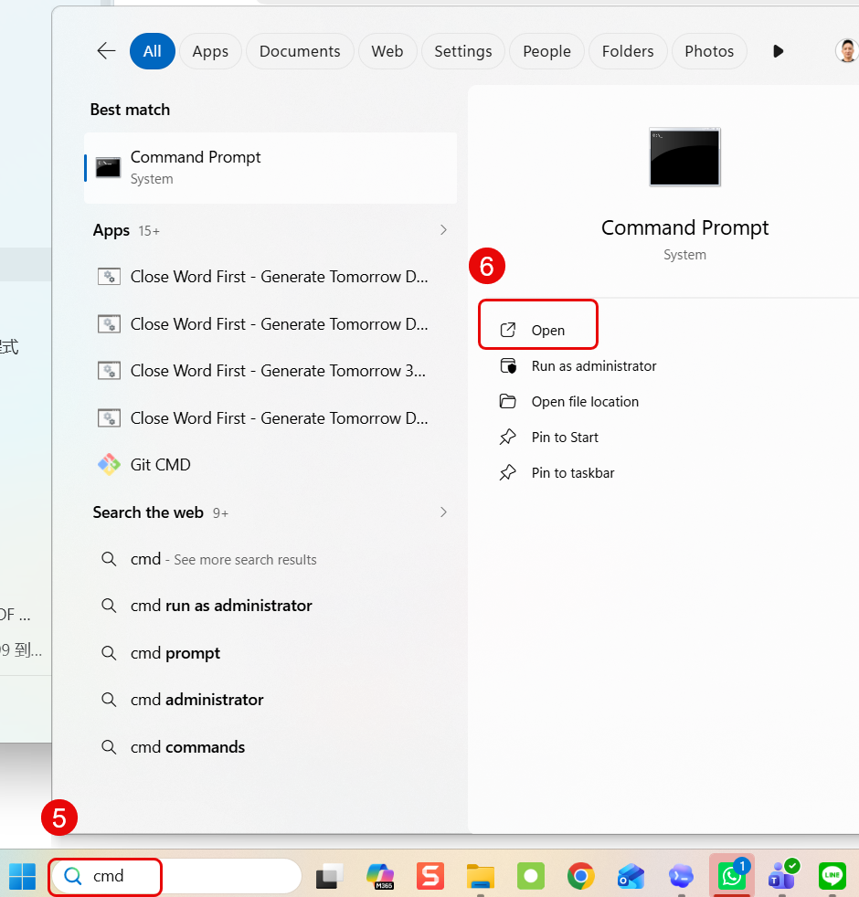
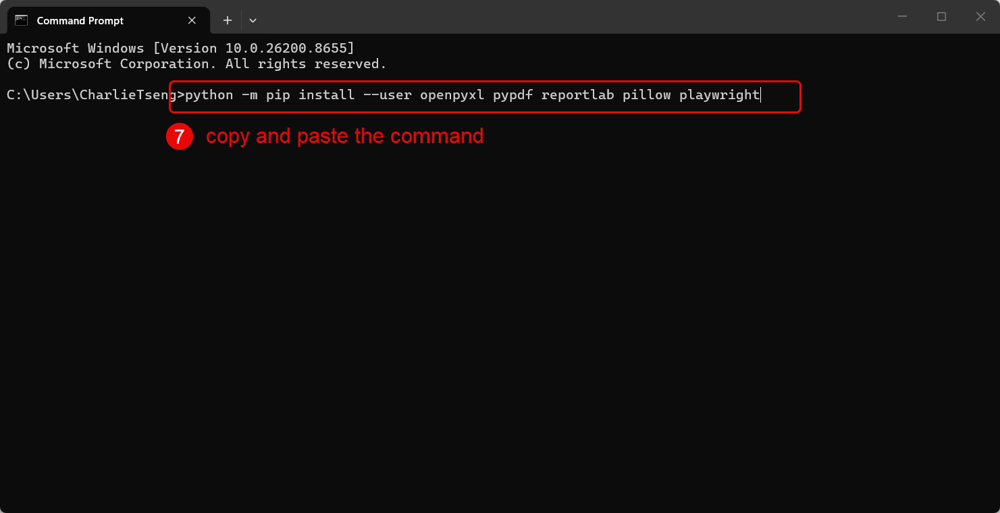

# Step 0 — SharePoint 與 OneDrive 前置設定

使用任何 OAIC ESR automation tool 前，請先完成這一步

第一次使用、自行重裝 OneDrive，或 OneDrive 本機路徑改變後，都需要先確認這個設定

## 1. 開啟 OAIC SharePoint

先開啟 OAIC SharePoint 首頁

```text
https://oaicltd.sharepoint.com/_layouts/15/sharepoint.aspx
```

找到需要的 project folder，並按 **Sync**，讓資料夾透過 OneDrive 同步到自己的電腦

## 2. 同步需要的資料夾

| Workflow | 需要同步的 SharePoint 資料夾 |
|---|---|
| 3DLA MoM | PROJECT TWSHXESR / Documents / General / 3-Day Look Ahead - 3DLA / MoM |
| 3DLA Overview | PROJECT TWSHXESR / Documents / General / 3-Day Look Ahead - 3DLA / Overview |
| ESR Training automation | PROJECT TWSHXESR / Documents / General / ESR AutoDoc Hub / 04_ESR Training |
| ESR Register | PROJECT TWSHXESR / Documents / General / Safety Document - SFD Register |
| DPR | PROJECT TWSHXHV / Documents / General / 08. Communication / 01. Report / offshore daily report |

請使用目前在你電腦上正常同步的資料夾

不同使用者的本機 OneDrive 路徑可能會不一樣，這是正常的

## 3. 確認本機 OneDrive 路徑

同步完成後，請在 File Explorer 裡確認資料夾已出現在本機 OneDrive 路徑底下

常見範例如下

```text
OAIC Ltd\PROJECT_TWSHXESR - Documents\General\3-Day Look Ahead - 3DLA\MoM
```

```text
OAIC Ltd\PROJECT_TWSHXESR - Documents\General\3-Day Look Ahead - 3DLA\Overview
```

```text
OAIC Ltd\PROJECT_TWSHXESR - Documents\General\ESR AutoDoc Hub\04_ESR Training
```

```text
OAIC Ltd\PROJECT_TWSHXESR - Documents\General\Safety Document - SFD Register
```

```text
OAIC Ltd\PROJECT_TWSHXHV - Documents\General\08. Communication\01. Report\offshore daily report
```

如果電腦裡有兩組類似路徑，請使用目前 OneDrive 正在同步的那一組

## 4. 先讓最新 automation file 下載到本機

同步資料夾後，請先點擊或開啟最新版本的 automation file 一次，讓 OneDrive 先下載到本機

請依照 workflow 確認相關檔案

- 最新 3DLA MoM automation file
- 最新 3DLA Overview automation file
- 最新 DPR automation file
- 最新 ESR Training automation file
- 目前使用的 template version，例如需要時包含 04/07 版本

如果檔案還是 cloud-only 狀態，請不要直接執行 automation

## 5. 為 ESR Training 安裝 Python

目前 ESR Training automation 需要 Python，每台電腦只需安裝一次。

**1.** 開啟 Python 官方的 [Windows 下載頁面](https://www.python.org/downloads/windows/)，在 **Stable Release** 下方下載 **Windows installer (64-bit)**。



**2.** 如果 HP Sure Click 顯示防護訊息，先確認檔案來自 `python.org`，再點選 **Remove protection and open**。



**3.** 勾選 **Add python.exe to PATH**；除非系統要求管理員授權，否則不要勾選 **Use admin privileges when installing py.exe**。



**4.** 點選 **Install Now**，等待 Python 安裝完成。

**5.** 開啟 Windows 搜尋並輸入 `cmd`。

**6.** 在 **Command Prompt** 下方點選 **Open**，不需要使用系統管理員模式。



**7.** 複製以下完整指令，貼到 Command Prompt，按下 **Enter**，並等待套件安裝完成：

```cmd
python -m pip install --user openpyxl pypdf reportlab pillow playwright
```



這一行指令會一次安裝目前 AutoDoc 工具需要的所有 Python 套件。

MoM、Overview 與 DPR 目前使用 Windows PowerShell 和 Microsoft Office，不需要額外的 Python 套件。

**8.** 關閉 Command Prompt，再次執行 ESR Training 啟動程式。

## 6. 關閉相關 Office 檔案

執行 automation 前，請先關閉相關的 Word 或 Excel 檔案

這可以避免 Office 鎖住檔案，導致 automation 無法正常修改或產生文件

## 執行前快速確認

| 檢查項目 | 預期狀態 |
|---|---|
| SharePoint 資料夾已同步 | 資料夾出現在本機 OneDrive |
| 最新 automation file 已點擊或開啟一次 | 檔案已下載到本機 |
| 相關 Word 或 Excel 已關閉 | 不會發生檔案鎖定 |
| 選擇正確 workflow 資料夾 | MoM、Overview、DPR 或 ESR Training 路徑正確 |

## 如果 automation 找不到檔案

請先檢查以下項目

1. 確認 SharePoint 資料夾已完成同步
2. 確認檔案不是 cloud-only 狀態
3. 確認使用的是目前有效的 OneDrive 路徑
4. 關閉相關 Office 檔案後再試一次
5. 如果牽涉 ESR / ENSR / WTSR 邊界不清楚，請 escalate 給 SAP 或 automation owner
